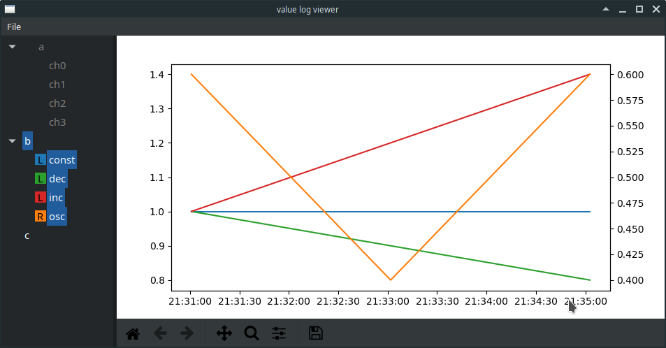

# CSV plotter

CSV plotter displays a tree of CSV source files and the columns available in those files, and a matplotlib plot with a single horizontal axis, and a pair of vertical axes.  Items selected in the tree are displayed on the plot. 

Items which contain no data are marked with light text, and those which could not be parsed are marked with red text.

The tree also serves as a plot legend, showing the colour of the trace for plotted data, and the letter 'L' or 'R' to indicate whether the trace is on the left or right vertical axis.

Right-clicking in the tree produces a context menu with the following actions:
  * remove all items from the tree;
  * (for file entires) remove this file from the treel
  * (for column entries) switch the vertical axis for the trace corresponding to this column.

CSV plotter can be invoked from the command line with a list of CSV files or folders containing CSV files as an argument. Files and folders may also be loaded from the File menu in the application.